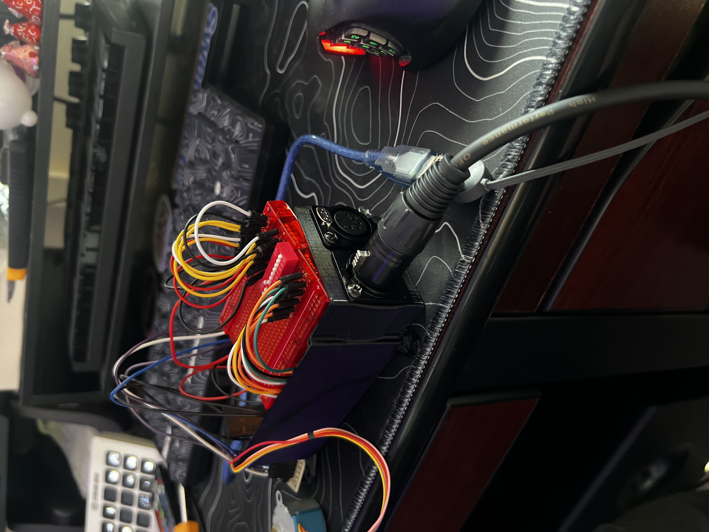

# Arduino as a DMX Fixture

Arduino DMX Fixture is an open-source project designed to bridge the gap between the DMX512 lighting control protocol and the versatility of the Arduino platform. This repository contains all the source code, hardware schematics, and detailed documentation needed to control DMX-based lighting fixtures using Arduino.

## Software Dependencies

Please install these dependencies in your Arduino IDE Sketch

- [DMX Serial](https://github.com/mathertel/DMXSerial)
- [AccellStepper](https://www.airspayce.com/mikem/arduino/AccelStepper/)

## Hardware Requirements

Here's what you'll need to buy to use this project:

* [Arduino Mega 2560 Rev3](https://store-usa.arduino.cc/products/arduino-mega-2560-rev3?utm_source=google&utm_medium=cpc&utm_campaign=US-Pmax&gad_source=1&gclid=CjwKCAjwktO_BhBrEiwAV70jXg7FVEfAY4_tfD8f-hzsaEpySIW2asjHwm7olEn0655CEIpmkLJi8BoCdgsQAvD_BwE)
* [TTL to RS485 Converter](https://www.amazon.com/HiLetgo-Reciprocal-Hardware-Automatic-Converter/dp/B082Y19KV9/ref=asc_df_B082Y19KV9?mcid=6ccbe713dc33343481eb371fa195af5a&hvocijid=1956269248307366501-B082Y19KV9-&hvexpln=73&tag=hyprod-20&linkCode=df0&hvadid=721245378154&hvpos=&hvnetw=g&hvrand=1956269248307366501&hvpone=&hvptwo=&hvqmt=&hvdev=c&hvdvcmdl=&hvlocint=&hvlocphy=9022159&hvtargid=pla-2281435177818&psc=1) (Any similar converter will also work, check documentation for how to connect to serial ports)
* [USB to DMX Converter](https://www.sweetwater.com/store/detail/OpenDMXUSB--enttec-open-dmx-usb-512-ch-non-isolated-dmx-interface?cond=OpenDMXUSBd4&dhla=1&mrkgadid=&mrkgcl=28&mrkgen=&mrkgbflag=&mrkgcat=&acctid=21700000001645388&dskeywordid=92700080545109799&lid=92700080545109799&ds_s_kwgid=58700008752923983&ds_s_inventory_feed_id=97700000007215323&dsproductgroupid=2388156999727&product_id=OpenDMXUSBd4&prodctry=US&prodlang=en&channel=online&storeid=&device=c&network=g&matchtype=&adpos=largenumber&locationid=9022159&creative=708042330121&targetid=pla-2388156999727&campaignid=21517650372&awsearchcpc=1&gad_source=1&gclid=CjwKCAjwktO_BhBrEiwAV70jXteuZD_rKhVQg7z1dc1qIurzi5YEHtsyeYtbvdCbwLXuT8GPZjOBbRoCQr4QAvD_BwE&gclsrc=aw.ds)(Can also use light board / dmx controller; just need to send DMX to the Arduino)
* [5-pin XLR Male Wall Mount Connector](https://www.amazon.com/gp/product/B0B1X5CT5W/ref=ewc_pr_img_1?smid=AQNSZ4MS7YO2W&psc=1) (Or similar)
* [5-pin XLR Female Wall Mount Connector](https://www.amazon.com/GDQLCNXB-Speaker-Microphone-Connector-Housing/dp/B0B1X4JXYX/ref=pd_sim_hxwPM1_sspa_dk_detail_d_sccl_4_1/138-9108235-8779958?pd_rd_w=D0v3b&content-id=amzn1.sym.3a852a98-d65f-4301-9bd0-9b589b14d1ef&pf_rd_p=3a852a98-d65f-4301-9bd0-9b589b14d1ef&pf_rd_r=0AN709K4H5VSHVTWF68R&pd_rd_wg=dp4XH&pd_rd_r=27200f2c-01df-4e79-ad1a-6f6603943c88&pd_rd_i=B0B1X4JXYX&psc=1)(Or similar)
* [10 Position DIP Switch](https://www.amazon.com/Assorted-Position-Mountable-Circuit-Breadboards/dp/B07B8LQZ3P?source=ps-sl-shoppingads-lpcontext&ref_=fplfs&psc=1&smid=A6QA7SV6MW7GH&gQT=1) (Optional)
* [3D print file for case](https://drive.google.com/drive/folders/1eCiPvZrcSw3PHqiTzzViSME9qFiEotIJ?usp=drive_link)(Optional)

## Getting Started

### The basics

The hardest part about this project is soldering the connections and passthrough for the 5-pin DMX wall mount connectors. Because of the design of the case is meant to be for a more permanent installation it requires more finesse to assemble.  

### Assembly

The initial setup for basic control is pretty simple. The most important thing is making sure you know which pins are which in the DMX protocol; depending on which wall mount connectors you got they should be labeled. 

The digram below shows a simple wiring setup for the RS485 module to hook up to the Arduino:

```js
   Arduino MEGA       RS-485 Module         DMX (3-pin XLR)
   ------------       --------------        ----------------
   5V           --->  VCC (5V)
   GND          --->  GND  ----------------  XLR Pin 1 (GND)
   Pin 0 (RX)   --->  RXD
   Pin 1 (TX)   --->  TXD

   A+           --->  XLR Pin 3 (Data+)
   B-           --->  XLR Pin 2 (Data-)

```


Additionally you may chose to hook up the DIP switch, it is easiest to hook it up to a small bread board then connect it to the analog pins A0-A9.


